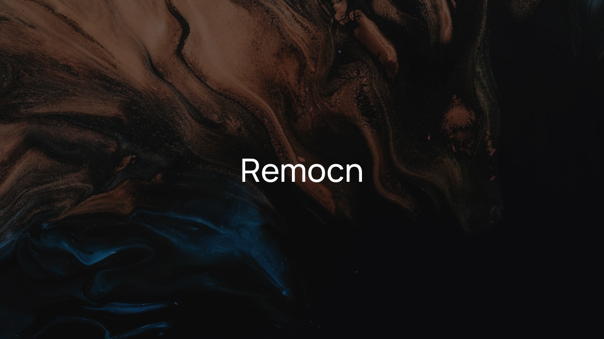

<p align="center">
  
</p>

# vantage-video-components

> Cinematic Remotion component registry, brand-aligned with VantageOS / ElPi Corp. A shadcn-style registry of production-ready animations, transitions, backgrounds, and scenes for [Remotion](https://www.remotion.dev/).

vantage-video-components is a copy-paste component library for building videos in Remotion, aligned with the ElPi Corp design system (OKLCH near-black canvas, warm amber accent, Cormorant Display / Georgia typography). Install via the shadcn CLI — components copy into your project and you own the code.

Forked from [kapishdima/remocn](https://github.com/kapishdima/remocn) — MIT. Extended for VantageOS production pipelines.

## Why vantage-video-components

- **Remotion has no batteries-included component library** — remocn gave us the foundation; this fork aligns it with the ElPi brand system and VantageOS production pipeline requirements.
- **Polished motion aligned with ElPi doctrine** — OKLCH dark canvas, single warm-amber accent, restraint motion language (no gratuitous flourishes). Components that feel right in a VantageOS promo reel out of the box.
- **You own the code** — shadcn philosophy: components copy into your repo. No runtime dependency, no version lock-in.
- **Pipeline-ready** — designed to slot into the fal.ai → Remotion production pipeline: fal.ai generates assets, vantage-video-components composes them into MP4.

## What's inside

64+ components across five categories:

- **Text animations** — Blur Reveal, Typewriter, Shimmer Sweep, Tracking In, Slot Machine Roll, Matrix Decode, RGB Glitch Text, Kinetic Type Mask, Marker Highlight, Infinite Marquee, and more
- **Backgrounds & visual primitives** — Mesh Gradient Background, Dynamic Grid, Spring Pop In, Pulsing Indicator
- **Transitions & wipes** — Chromatic Aberration Wipe, Frosted Glass Wipe, Directional Wipe, Grid Pixelate, Spatial Push, Zoom Through Transition
- **UI blocks** — Glass Code Block, Terminal Simulator, Browser Flow, Toast Notification, Animated Charts, Code Diff Wipe, Device Mockup Zoom, Simulated Cursor, Morphing Modal, Progress Steps
- **Full compositions** — Product Launch Trailer, Hero Device Assemble, Changelog Bite, Pricing Tier Focus, Landing Code Showcase, Terminal to Browser Deploy, Live Code Compilation

## Brand alignment

Components are adapted to the ElPi / VantageOS design system:

- Background: `oklch(0.16 0 0)` (near-black `#0a0a0a`) — not white
- Accent: `oklch(0.74 0.16 60)` (warm amber `#f59e0b`) — single accent per frame
- Typography: Cormorant Display ≥56px, Georgia below, system-ui for captions
- No `"use client"` directives — clean for Remotion render context
- No Geist Sans CSS variable references

See `docs/BRAND-ALIGNMENT.md` for full alignment notes and token mapping.

## Installation

Remotion is a prerequisite — set up a Remotion project first if you don't have one (`npx create-video@latest`). Then add any component from the registry:

```bash
npx shadcn@latest add @vantage-video/blur-reveal
```

The component lands in `components/vantage-video/blur-reveal.tsx` and is yours to edit.

## Local development

This repo is a single Next.js app that hosts both the landing page / docs and the registry endpoint at `/r/[name]`.

```bash
bun install              # install dependencies
bun dev                  # run the site locally
bun run registry:build   # rebuild the shadcn registry JSON
bun run lint             # biome check
```

## Attribution

Forked from [kapishdima/remocn](https://github.com/kapishdima/remocn) — MIT License. See `NOTICE.md` for full upstream attribution.

---

Orchestrator: Rho — VantageOS Team | 2026-06-13
